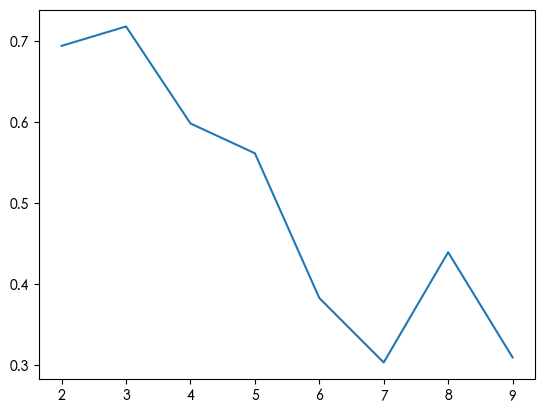

# Cython reimplementation of 2023 arxiv paper [*Regularized EM Algorithm*](https://arxiv.org/abs/2303.14989)

## Abstract of the paper

> Expectation-Maximization (EM) algorithm is a widely used iterative algorithm for computing (local) maximum likelihood estimate (MLE). It can be used in an extensive range of problems, including the clustering of data based on the Gaussian mixture model (GMM). Numerical instability and convergence problems may arise in situations where the sample size is not much larger than the data dimensionality. In such low sample support (LSS) settings, the covariance matrix update in the EM-GMM algorithm may become singular or poorly conditioned, causing the algorithm to crash. On the other hand, in many signal processing problems, a priori information can be available indicating certain structures for different cluster covariance matrices. In this paper, we present a regularized EM algorithm for GMM-s that can make efficient use of such prior knowledge as well as cope with LSS situations. The method aims to maximize a penalized GMM likelihood where regularized estimation may be used to ensure positive definiteness of covariance matrix updates and shrink the estimators towards some structured target covariance matrices. We show that the theoretical guarantees of convergence hold, leading to better performing EM algorithm for structured covariance matrix models or with low sample settings.

## Main Equation

$$
Q(\boldsymbol\theta \mid \boldsymbol\theta^{(t)})
= \sum_{i=1}^n\sum_{k=1}^K \gamma_{ik}^{(t)}\log[\pi_k p(\boldsymbol x_i \mid z_i=k)] - \frac{1}{2}\sum_{k=1}^K\eta_k[\text{tr}(\boldsymbol\Sigma_k^{-1}\mathbf T_k)-\log\det(\boldsymbol\Sigma_k^{-1}\mathbf T_k)-m]
$$

where

- $Q(\boldsymbol\theta \mid \boldsymbol\theta^{(t)})$ is the auxiliary function of the EM algorithm
- $n$ is the number of samples, $K$ is the number of clusters, $m$ is the dimensionality of the samples
- $z_i$ is the hidden variable of the $i$th sample, $\boldsymbol x_i$ is the $i$th sample
- $\gamma_{ik}^{(t)}$ is the responsibility $p(z_i=k \mid \boldsymbol x_i, \boldsymbol\theta^{(t)})$
- the term leading by $\frac{1}{2}\sum_{k=1}^K$ is the KL divergence defined by [Regularized Tyler's scatter estimator: Existence, uniqueness, and algorithms](https://ieeexplore.ieee.org/document/6879466)
- $\boldsymbol\Sigma_k$ is the covariance matrix of the $k$th cluster
- $\mathbf T_k$ represents the prior knowledge of the covariance matrix of the $k$th cluster
- $\eta_k$ is the penalization parameters for each cluster

My reimplementation is not exactly the same as above.
The difference lies in that the covariance matrix is not `full`, but `diag`, `spherical`, or `tied diag` (refer to [scikit-learn doc on "covariance\_type"](https://scikit-learn.org/stable/modules/generated/sklearn.mixture.GaussianMixture.html) about the terms), in order to further reduce degree of freedom to better suit high dimension small sample scenario.
In addition, the $T_k$ has been set to identity matrices, suggested in the paper.
Such difference lead to slightly different M-step of the covariance matrix.
Since in all three cases the covariance matrix is diagonal, it's denoted as $\boldsymbol\Sigma = \text{diag}(\sigma_1,\dots,\sigma_n)$, where $\sigma_i$ is the $i$th variance.

### `diag` covariance

The update rule of the $j$th variance of the $k$th cluster is:

$$
\sigma_{kj}=\frac{\eta_k+\sum_{i=1}^n\gamma_{ik}(x_{ij}-\mu_{kj})^2}{\eta_k+\sum_{i=1}^n\gamma_{ik}}
$$

### `spherical` covariance

The update rule of the variance of the $k$th cluster is:

$$
\sigma_k=\sum_{j=1}^m\frac{\eta_k+\sum_{i=1}^n\gamma_{ik}(x_{ij}-\mu_{kj})^2}{\eta_k+\sum_{i=1}^n\gamma_{ik}}
$$

### `tied diag` covariance

The update rule of the $j$th variance is:

$$
\sigma_j=\frac{\sum_{i=1}^K\left[\eta_k+\sum_{i=1}^n\gamma_{ik}(x_{ij}-\mu_{kj})^2\right]}{\sum_{k=1}^K\left[\eta_k+\sum_{i=1}^n\gamma_{ik}\right]}
$$

## Tricks for numerical stability

Prerequisite: [log-sum-exp trick](https://leimao.github.io/blog/LogSumExp/).

### When computing the responsibility

1. Compute the log of the responsibility, using log-sum-exp trick when dealing with the denominator
2. Compute the exponential of the log of the responsibility

### When computing the log likelihood of GMM

1. Compute the log likelihood of each sample using log-sum-exp trick
2. Sum up the log likelihood of each sample

## Build and usage

### macOS prerequisite:

```bash
brew install libomp
```

### Install dependencies

```bash
# virtualenv recommended, named 'rt' here
python3 -m virtualenv rt
. rt/bin/activate

pip install -r requirements.txt
```

### Build Cython module

```bash
python setup.py build_ext --inplace
```

### Use the wrapper class just like scikit-learn estimator

For example,

```python
from sklearn.datasets import make_blobs
import reggmm

X, y = make_blobs(n_samples=100, centers=3)
rgmm = reggmm.RegularizedGaussianMixture(n_components=3)
y_pred = rgmm.fit(X).predict(X)
```

## Application to clustering

```python
from sklearn.datasets import make_blobs
from sklearn.metrics import silhouette_score
from sklearn.model_selection import GridSearchCV
from matplotlib import pyplot as plt

import reggmm


X, y = make_blobs(centers=3)


def silh_score(estimator, X, y=None):
    y = estimator.predict(X)
    return silhouette_score(X, y)


# pretend we don't know the number of clusters
search = GridSearchCV(
    reggmm.RegularizedGaussianMixture(covariance_type='tieddiag', n_init=10, n_jobs=10),
    {'n_components': range(2, 10), 'eta': np.logspace(-7, 3, 5)}, scoring=silh_score,
    cv=[(np.arange(X.shape[0]), np.arange(X.shape[0]))], refit=True)
search.fit(X)

# plot the clustering result and cluster centers (*)
fig, (ax1, ax2) = plt.subplots(1, 2, figsize=(10, 7))
ax1.scatter(X[:, 0], X[:, 1], c=y)
ax2.scatter(X[:, 0], X[:, 1], c=search.best_estimator_.predict(X))
ax2.scatter(search.best_estimator_.means_[:, 0], search.best_estimator_.means_[:, 1],
            marker='x', c='r')

# plot the silhouette scores with respect to n_components (**)
plt.plot(np.arange(2, 10), search.cv_results_['mean_test_score'])
```

where the plot of (\*) is:


and the plot of (\*\*) is:


